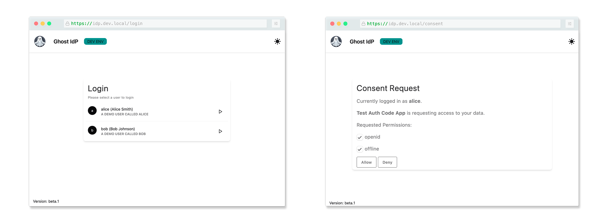

# ghostidp

A mock Identity Provider to support development.

## Concept

ghostidp is born from a development need to have hard-coded users in an OpenID Compliant Identity Provider.

The goal was to have an easy to setup/configure development Identity Provider which could be preloaded with
demo users having different claims. This allows, for instance, to simulate different roles or different identity providers.

In practice, ghostidp is simply a custom UI implementation of the login and consent screens of [Ory Hydra](https://github.com/ory/hydra).

Users have no password and can simply be selected out of a list of all available users.
This, in addition to the absence of session, makes for an easy way to switch from one user to another.

At the moment, ghostidp focuses on scenarios where the obtained JWT token is only used for authenticating the user in the application.



## Getting started

In the examples below, Hydra is deployed using Docker or Kubernetes.

### Configuring Users

Available users are provided to ghostidp via a config file such as:

```yaml
users:
  - username: alice
    description: |
      A demo user called Alice
    email: alice@example.com
    given_name: Alice
    family_name: Smith
    custom_claims:
      roles:
        - admin
        - user
      department: engineering
      employee_id: "12345"
```

`username`, `email`, `given_name` and `family_name` are used to populate the standard claims of the JWT token.
Everything under `custom_claims` will be added as-is to the JWT token. 

You can use `custom_claims` to provide claims that will fit your application's needs.

The `description` field is used to provide a description of the user in the UI users' list.

### Docker

To run both `ghostidp` and Hydra in Docker:

1. Start both services with `task start-idp`
2. Create a client for your application (omit `id` and `secret` if you want `hydra` to generate them for you):
```bash
docker exec ghostidp_hydra hydra create client \
  --name "Demo client" \
  --endpoint http://127.0.0.1:4445 \
  --grant-type authorization_code,refresh_token \
  --response-type code,id_token \
  --format json \
  --scope openid --scope offline \
  --redirect-uri http://127.0.0.1:5050/callback \
  --skip-consent \ # Whether we trust the client and can skip the consent page.
  --id "[id]" \
  --secret "[secret]"
```
3. Use the resulting `client_id` and `client_secret` values in your application.

The Auth URL is `http://127.0.0.1:4444/oauth2/auth`, and the Token URL is `http://127.0.0.1:4444/oauth2/token`.

To clean up, run `task clean-idp`

### Kubernetes

To run `ghostidp` in a local Kubernetes cluster:

1. Make sure that the domain `idp.dev.local` resolves to 127.0.0.1. On Unix, add the following entries to your `/etc/hosts`:
```
# Local Development
::1             idp.dev.local
127.0.0.1       idp.dev.local
```

2. Spin up the local Kubernetes infrastructure by running `task boostrap-dev-cluster`.

> [!NOTE]  
> To make things a bit more interesting, this script also setups a Gateway that takes care of the TLS Termination.

3. Verify that the cluster is up and running with `kubectl get pods --all-namespaces`.

4. If you want the default OAuth2 client to be created automatically (`hydra.maester.enabled` is `true`), you also need to build the `hydra-maester` controller image (see https://github.com/ory/hydra-maester/pull/159).
```
# From your project folder
git clone git@github.com:guillaumebour/hydra-maester.git
git checkout feat/155-allow-user-defined-credentials
docker build -t localhost:5005/controller:latest -f .docker/Dockerfile-build .    
docker push localhost:5005/controller:latest
```

5. Install ghostidp to the cluster
```
helm install -f ./helm/values.https.yaml ghostidp ./helm/ghostidp 
```

### Running outside docker

In this scenario, mostly relevant for developing ghostidp, we run `ghostidp` on the host, and Hydra in Docker.

1. Start Hydra with `task start-hydra`
2. Run `ghostidp` with `go run cmd/idp/main.go -debug -users-file config/users.yaml`
3. Create a client for your application (omit `id` and `secret` if you want `hydra` to generate them for you):
```bash
docker exec ghostidp_hydra hydra create client \
  --name "Demo client" \
  --endpoint http://127.0.0.1:4445 \
  --grant-type authorization_code,refresh_token \
  --response-type code,id_token \
  --format json \
  --scope openid --scope offline \
  --redirect-uri http://127.0.0.1:5050/callback \
  --skip-consent \ # Whether we trust the client and can skip the consent page.
  --id "[id]" \
  --secret "[secret]"
```
4. Use the resulting `client_id` and `client_secret` values in your application.

The Auth URL is `http://127.0.0.1:4444/oauth2/auth`, and the Token URL is `http://127.0.0.1:4444/oauth2/token`.

To clean up, run `task clean-idp`
