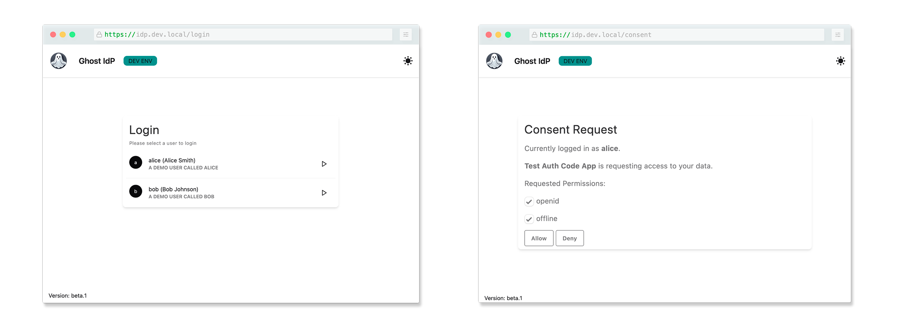

# Introduction

_ghostidp_ is a mock Identity Provider to support development.

## Concept

_ghostidp_ is born from a development need to have hard-coded users in an OpenID Compliant Identity Provider.

The goal was to have an easy to setup/configure development Identity Provider preloaded with demo users having different claims.
This allows, for instance, to simulate different roles or different identity providers.

In practice, _ghostidp_ is a custom UI implementation of the [login and consent screens](https://www.ory.sh/docs/oauth2-oidc/custom-login-consent/flow) of [Ory Hydra](https://github.com/ory/hydra).

Users have no password and can simply be selected out of a list of all available users. This, in addition to the absence of session, makes for an easy way to switch from one user to another.

At the moment, _ghostidp_ focuses on scenarios where the obtained JWT token is only used for authenticating the user in the application.

> [!WARNING]  
> It should be obvious from the above text, _ghostidp_ is meant for development only, and should not be used in a production environment.

## Contributing

_ghostidp_ is free and open source. You can find the source code on [GitHub](http://github.com/guillaumebour/ghostidp) and issues and feature requests can be posted on the GitHub issue tracker.

## License

_ghostidp_ source and documentation are released under the [MIT License](https://github.com/guillaumebour/ghostidp/blob/main/LICENSE).
