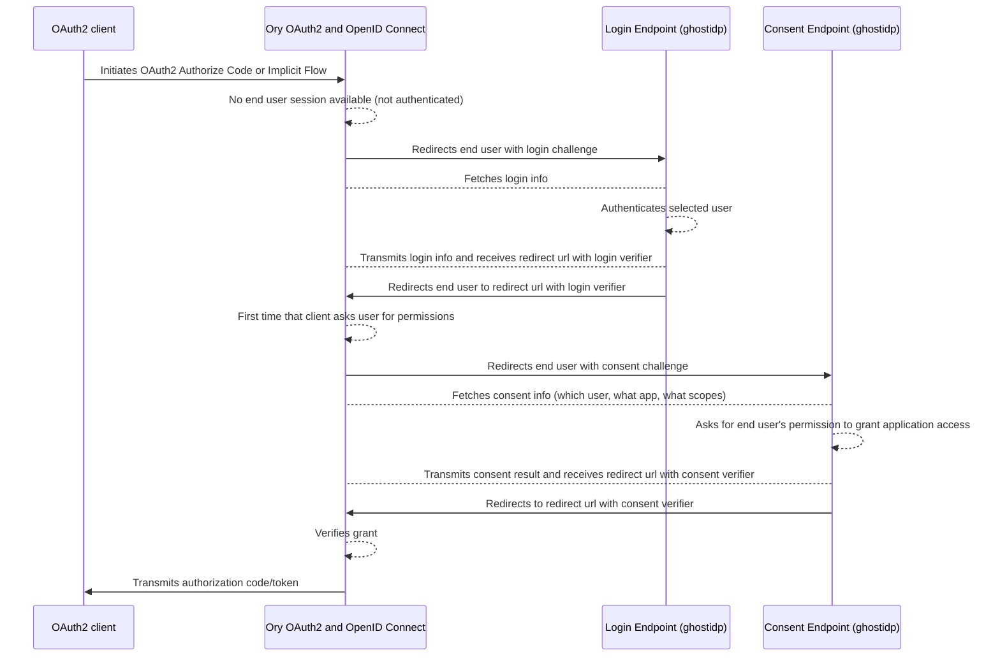

# Concept

_ghostidp_ is built on top of Ory Hydra as an implementation of the "Ory OAuth 2.0 login & consent flow."

Ory Hydra is an OpenID Certified OAuth 2.0 Server and OpenID Connect Provider, and as such, it doesn't contain a database with end users.
Instead, it delegates the login and consent flow to a dedicated application (in our case, _ghostidp_).

The full explanation of how this works from Hydra's perspective is available in Hydra's documentation: [User login and consent flow](https://www.ory.sh/docs/oauth2-oidc/custom-login-consent/flow).

## Sequence Diagram

Here is a sequence Diagram of what happens, adapted from the [Ory Hydra Documentation](https://www.ory.sh/docs/oauth2-oidc/custom-login-consent/flow#sequence-diagram):

